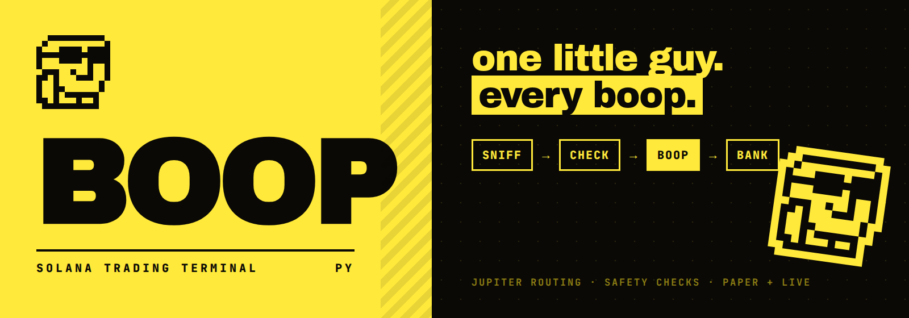
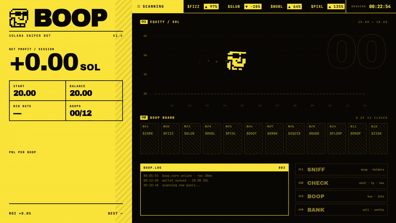
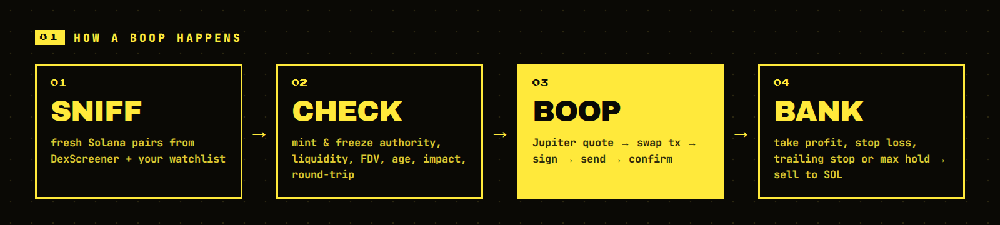
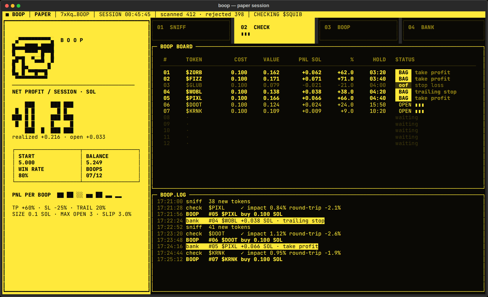

<p align="center">
  
</p>

<p align="center">
  
  
  
  
  
</p>

<p align="center"><b>A tiny Solana trading terminal with a pixel mascot who boops every trade.</b><br>
Sniffs fresh pools, checks them for the usual rug tricks, buys through Jupiter and banks the exit.<br>All in one yellow-and-black terminal window.</p>

<p align="center">
  
</p>

---

## ⬛ What it does

Most terminals are cold. Numbers, candles, a wall of data. BOOP is small on purpose: one Python process, one screen, one little guy.

<p align="center"></p>

| Stage | What happens |
|---|---|
| **SNIFF** | Pulls the latest Solana token profiles and boosts from DexScreener, plus any mints in your `WATCHLIST` |
| **CHECK** | Liquidity, FDV range and pair age → mint authority revoked → freeze authority revoked → Jupiter price impact → **round-trip test** (quote buy, then quote selling what you'd receive; big loss = honeypot or hidden tax) |
| **BOOP** | Gets a Jupiter quote, builds the swap tx with a priority fee, signs it locally, sends and confirms |
| **BANK** | Marks every open position against a live Jupiter sell quote and exits on take profit, stop loss, trailing stop or max hold time |

## ⬛ The terminal

<p align="center"></p>

The yellow slab on the left is your session: net profit in big block digits, balance, win rate, boop count and a PnL bar per trade. The right side shows the live pipeline stage, the **Boop Board** with every position, and the log. Winners get a `BAG` tag. Losers get an `oof`.

## ⬛ Quickstart

```bash
git clone https://github.com/<you>/boop.git
cd boop
python -m venv .venv && source .venv/bin/activate
pip install -r requirements.txt
cp .env.example .env
```

Get a Jupiter API key at [portal.jup.ag](https://portal.jup.ag) and a proper RPC (Helius, Triton, QuickNode…). The public RPC works for paper mode but rate-limits fast.

```bash
# paper mode: real market data and real Jupiter quotes, simulated fills
python -m boop run --paper

# live mode: real transactions from the wallet in PRIVATE_KEY
python -m boop run --live
```

Press `Ctrl+C` to stop. BOOP tries to sell anything still open before exiting.

### Other commands

```bash
python -m boop check <MINT>        # run every safety check on one token
python -m boop quote <MINT> 0.1    # quote 0.1 SOL → token via Jupiter
```

## ⬛ Config

Everything lives in `.env`. The defaults are deliberately small.

| Variable | Default | Meaning |
|---|---|---|
| `RPC_URL` | public mainnet | Solana RPC endpoint |
| `PRIVATE_KEY` | — | base58 key, JSON byte array, or path to a keypair file. Only needed for live |
| `JUP_API_KEY` | — | Jupiter API key |
| `PAPER` | `true` | simulate fills instead of sending transactions |
| `BUY_SOL` | `0.1` | size of each boop |
| `MAX_OPEN` | `3` | max simultaneous positions |
| `MAX_BOOPS` | `12` | trades per session, then BOOP goes to sleep |
| `MAX_SESSION_LOSS_SOL` | `0.5` | stop opening trades after this realized loss |
| `SLIPPAGE_BPS` | `300` | slippage for quotes/swaps |
| `TAKE_PROFIT_PCT` | `60` | exit when position is up this much |
| `STOP_LOSS_PCT` | `25` | exit when position is down this much |
| `TRAILING_PCT` | `20` | exit when it drops this far from its peak (after +10%) |
| `MAX_HOLD_SEC` | `900` | exit after this long no matter what |
| `MIN_LIQUIDITY_USD` | `15000` | skip thinner pools |
| `MIN_FDV_USD` / `MAX_FDV_USD` | `30k` / `3M` | market cap window |
| `MAX_PAIR_AGE_MIN` | `180` | only fresh pairs |
| `MAX_PRICE_IMPACT_PCT` | `5` | skip if your buy moves price more than this |
| `MAX_ROUNDTRIP_LOSS_PCT` | `10` | honeypot / tax detector threshold |
| `WATCHLIST` | — | comma-separated mints to always sniff |

## ⬛ Project layout

```
boop/
├── __main__.py   CLI: run / check / quote
├── config.py     .env → Config
├── sniff.py      DexScreener: fresh Solana pairs
├── checks.py     mint parsing + safety checks + round-trip test
├── jupiter.py    Jupiter Swap API (quote, swap tx)
├── rpc.py        minimal async Solana JSON-RPC
├── wallet.py     keypair loading
├── engine.py     the pipeline, positions, exits
├── ui.py         the yellow terminal (rich)
└── mascot.py     the little guy, in half-blocks
tests/            offline tests with fake RPC + Jupiter
```

```bash
pytest -q
```

## ⬛ Meet the little guy


13×13 pixels, two colors, zero chill. He lives in `mascot.py` as a string grid and is drawn with `▀` half-blocks, so he looks the same in any truecolor terminal. He hops when he boops, says `BAG!` when a winner closes and `oof` when it doesn't.

<br clear="left">

## ⬛ Safety notes

- Your private key never leaves your machine. Jupiter returns an **unsigned** transaction and BOOP signs it locally.
- Use a fresh hot wallet with only what you're willing to lose.
- Checks catch common traps (live mint authority, freeze authority, no sell route, heavy sell tax). They don't catch everything: dev dumps, bundled supply and coordinated rugs still happen.
- Run it in paper mode first and read the log.

> **Disclaimer.** BOOP is experimental open-source software, not financial advice. Memecoins are extremely risky and most go to zero. You are responsible for every transaction your wallet signs.

## ⬛ License

MIT
